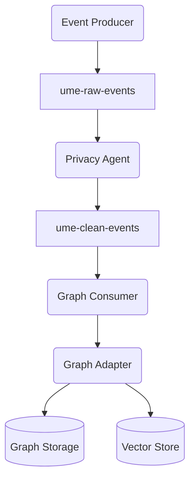
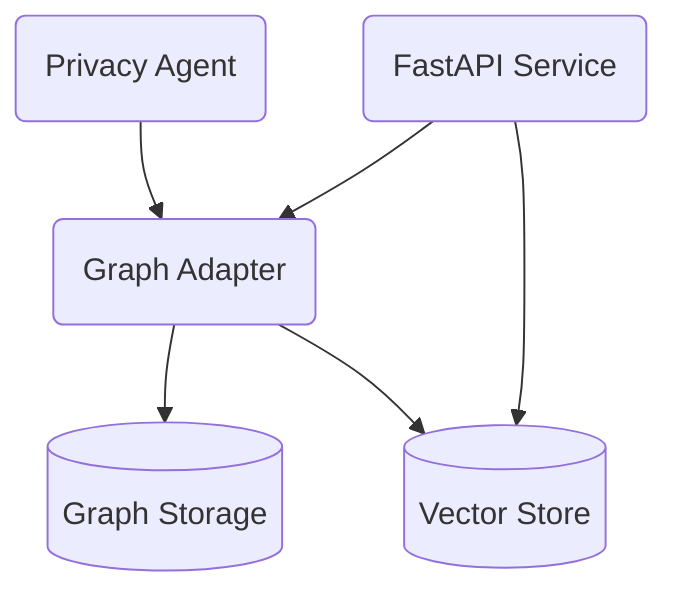
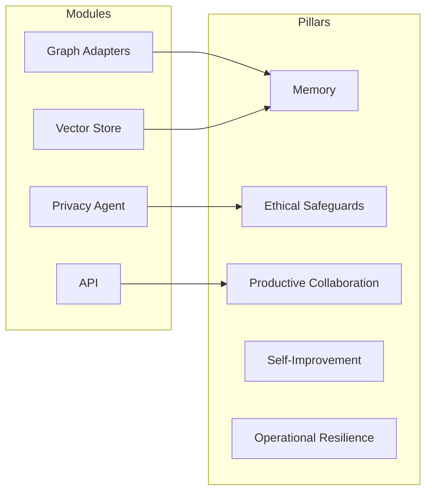
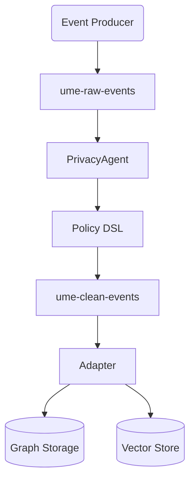
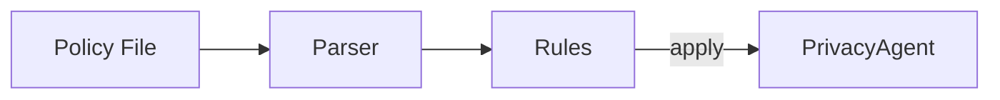
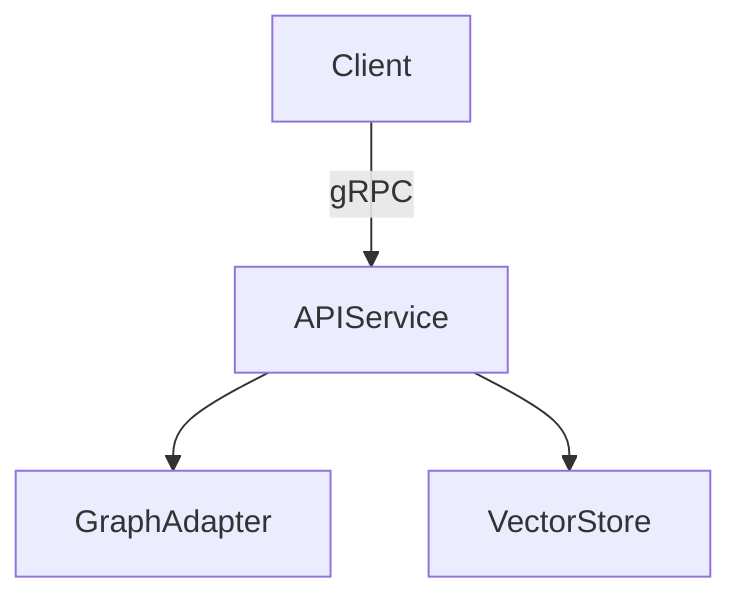

# Architecture Overview

This diagram illustrates how events flow through UME and how graph data and vector embeddings are stored.



Events originate from producers and are first written to the `ume-raw-events` topic. The Privacy Agent sanitizes sensitive
content before forwarding messages to `ume-clean-events`. A graph consumer processes these events through the configured
Graph Adapter. The adapter persists the knowledge graph to the chosen backend (SQLite, Neo4j, etc.) and stores
embeddings in a dedicated vector store.

When querying, the API can perform a similarity search against the vector store to retrieve relevant nodes and
then issue graph queries to traverse relationships.

When FAISS is compiled with GPU support, setting the environment variable
`UME_VECTOR_USE_GPU=true` transfers the index to GPU memory. Benchmarks with
100k vectors on an RTX 4080 show roughly a **5x** reduction in query latency
compared to CPU search (see [Vector Store Benchmark](VECTOR_BENCHMARKS.md)).

## Component Interactions

The API interfaces with the graph adapter layer and the vector store to answer
queries. The diagram below highlights how these core modules connect.



## Modules and Roadmap Pillars

The [ROADMAP](../ROADMAP.md) defines "Exocortic Eudaemon" pillars guiding the
project. This diagram links major modules to those pillars.



* **Privacy Agent** – implements **Ethical Safeguards** by redacting sensitive
  data before it is stored.
* **Graph Adapters** and **Vector Store** – provide persistent **Memory** for
  the knowledge graph and its embeddings.
* **API** – enables **Productive Collaboration** by exposing graph and vector
  search endpoints.
* The **Self-Improvement** and **Operational Resilience** pillars are primarily
  addressed by automation and infrastructure work described in the roadmap.

## Streaming Pipeline



Incoming events are streamed through Redpanda topics. The Privacy Agent applies
rules defined in the Policy DSL before forwarding sanitized events to the graph
adapter layer.

## Event Ledger

Sanitized events are appended to a lightweight ledger along with their
Redpanda offsets. The ledger can be queried via the `/ledger/events` API and
used with `PersistentGraph.replay_from_ledger()` to rebuild state from any
offset.

## Policy DSL Flow



Policies are written in a small domain specific language and loaded at startup
by the Privacy Agent. They dictate how data should be redacted or blocked.

## gRPC Services



All core APIs are exposed over gRPC, enabling efficient streaming queries from
external agents and services. Authentication is handled via a shared bearer
token configured by the `UME_GRPC_TOKEN` environment variable.

## Agent Message Format

Worker output is wrapped in a small JSON envelope before being processed by
reflection and critic agents:

```json
{
  "content": "string",
  "meta": {"optional": "metadata"}
}
```

The `ReflectionAgent` can modify this envelope (for example to filter
hallucinated text) before the `Critic` scores the final `content`.

## Dashboard Recommendations

The web dashboard now includes a view showing the overseer's recommended
actions. Data is fetched from the `/recommendations` endpoint and each
item can be accepted or rejected. User feedback is stored for future
analysis and helps refine subsequent suggestions.
