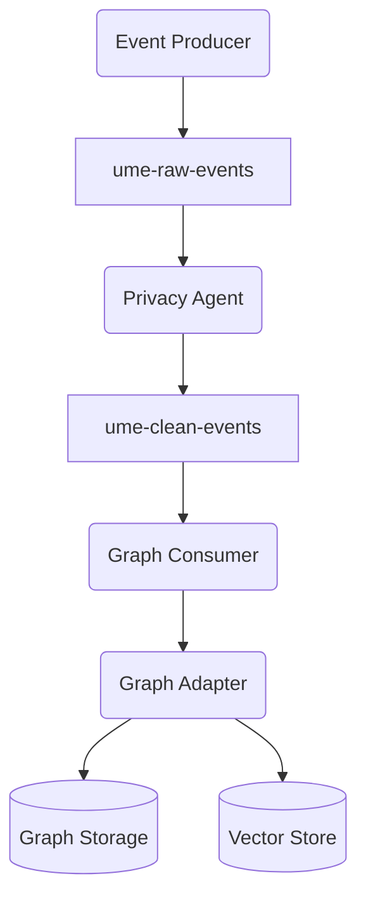

# Architecture Overview

This diagram illustrates how events flow through UME and how graph data and vector embeddings are stored.

Events originate from producers and are first written to the `ume-raw-events` topic. The Privacy Agent sanitizes sensitive
content before forwarding messages to `ume-clean-events`. A graph consumer processes these events through the configured
Graph Adapter. The adapter persists the knowledge graph to the chosen backend (SQLite, Neo4j, etc.) and stores
embeddings in a dedicated vector store.

When querying, the API can perform a similarity search against the vector store to retrieve relevant nodes and
then issue graph queries to traverse relationships.

When FAISS is compiled with GPU support, setting the environment variable
`UME_VECTOR_USE_GPU=true` transfers the index to GPU memory. Benchmarks with
100k vectors show roughly a **5x** reduction in query latency compared to CPU
search.
