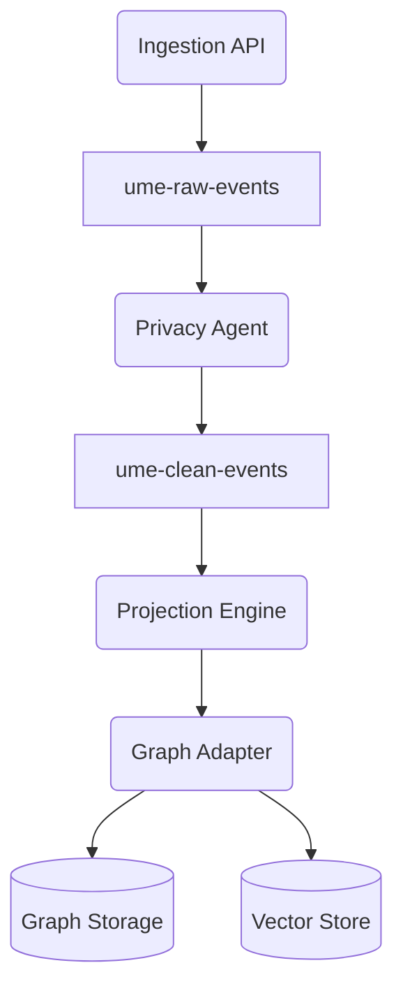
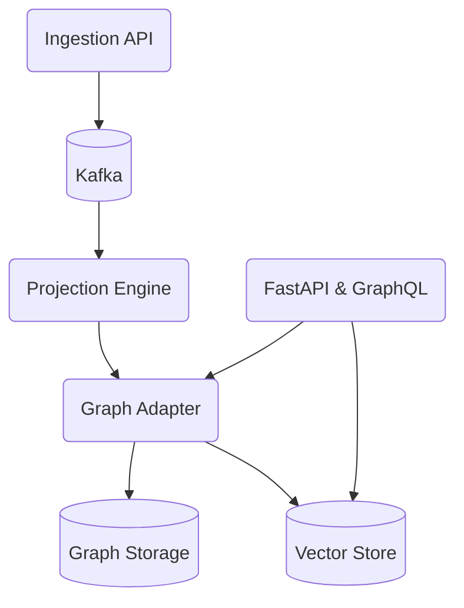
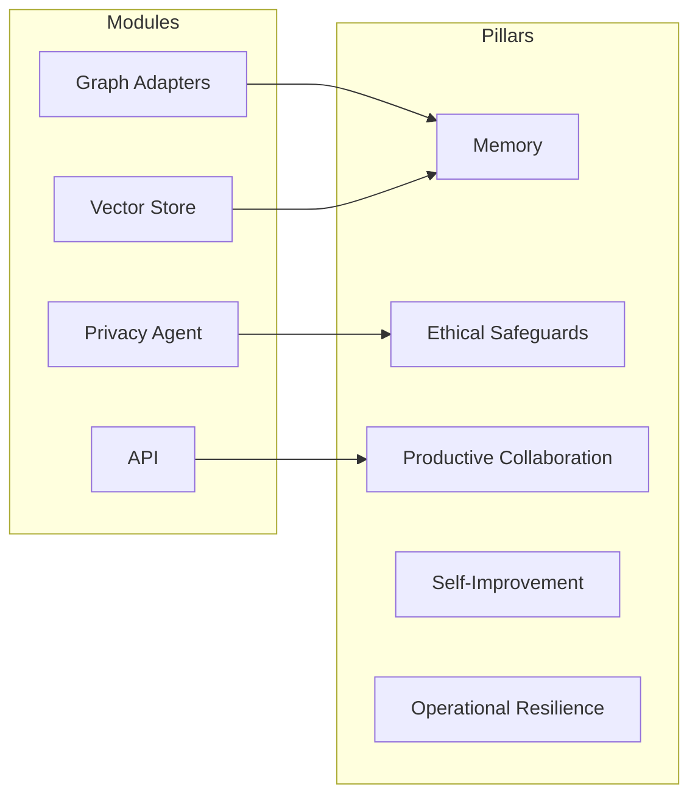
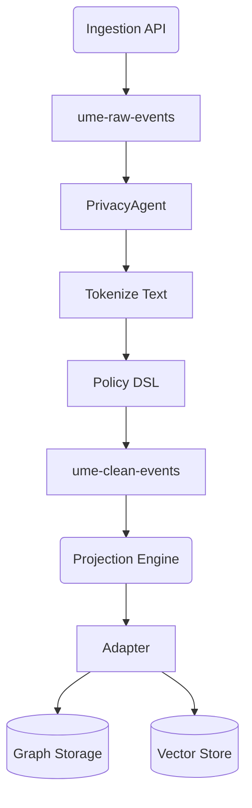
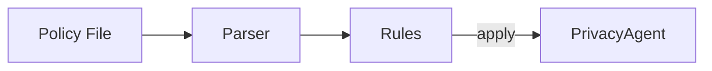
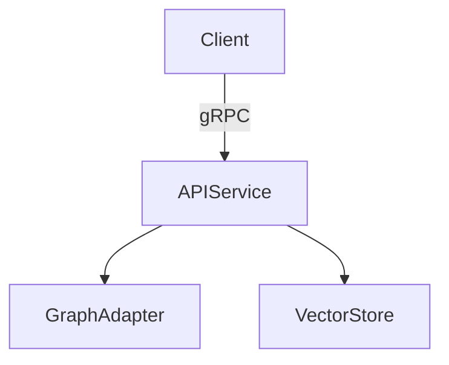

# Architecture Overview

This diagram illustrates how events flow through UME and how graph data and vector embeddings are stored.


```mermaid
graph TD
    Ingest(Ingestion API) --> RawEvents[ume-raw-events]
    RawEvents --> PrivacyAgent(Privacy Agent)
    PrivacyAgent --> CleanEvents[ume-clean-events]
    CleanEvents --> Projection(Projection Engine)
    Projection --> Adapter(Graph Adapter)
    Adapter --> GraphDB[(Graph Storage)]
    Adapter --> VectorStore[(Vector Store)]
```

Events enter the system through the **Ingestion API**, which publishes them to the `ume-raw-events` Kafka topic. The
Privacy Agent sanitizes sensitive content before forwarding messages to `ume-clean-events`. A dedicated **Projection Engine**
service consumes these sanitized events, applies them via the configured Graph Adapter, and keeps the graph synchronized with
the event stream. The adapter persists the knowledge graph to the backend selected by `create_graph_adapter()` from `src/ume/factories.py`. Supported `UME_GRAPH_BACKEND` values are `sqlite`, `postgres`, `redis`, `arango`, and `neo4j`.

Vector storage is configured separately from graph adapters through `src/ume/vector_store.py` (for example, `create_default_store()` and `VectorStore`). Backend choice is environment-driven via `UME_VECTOR_BACKEND` and resolved through the registered vector backend registry.

The vector store backend is selected with `UME_VECTOR_BACKEND`. In addition to FAISS and Chroma, UME supports Pinecone and Milvus via the vector backend abstraction in `src/ume/vector_store.py` and `src/ume/vector_backends/__init__.py`.
Set `UME_VECTOR_BACKEND=pinecone` and provide `UME_PINECONE_API_KEY`, `UME_PINECONE_ENVIRONMENT`, and `UME_PINECONE_INDEX`.
Text fields are tokenized before embeddings are generated using whichever tokenizer library is installed (`unitok`,
`tatitok`, or `tiktoken`).

## Implementation Status (Current vs Planned)

To keep architecture docs aligned with the codebase, the table below distinguishes what is implemented on `main` versus roadmap/experimental work.

| Area | Implemented on `main` | Planned / Experimental |
| --- | --- | --- |
| Graph persistence adapters | `sqlite`, `postgres`, `redis`, `arango`, `neo4j` via `create_graph_adapter()` | New graph adapters are roadmap items until implementation files and factory wiring are merged |
| Vector storage | Environment-selected vector backend via `src/ume/vector_store.py` (`UME_VECTOR_BACKEND`) | Additional vector providers can be added through the backend registry / plugin entry points |
| LanceDB usage | Not a shipped graph adapter in the current factory path | Any LanceDB integration should be documented as future/experimental until code is present |

When querying, the API can perform a similarity search against the vector store to retrieve relevant nodes and
then issue graph queries to traverse relationships.

When FAISS is compiled with GPU support, setting the environment variable
`UME_VECTOR_USE_GPU=true` transfers the index to GPU memory. Benchmarks with
100k vectors on an RTX 4080 show roughly a **5x** reduction in query latency
compared to CPU search (see [Vector Store Benchmark](VECTOR_BENCHMARKS.md)).

## Projection Engine Service

The projection engine runs continuously as a consumer of `ume-clean-events`.
Each event is parsed and applied to the graph through an adapter instance created by `create_graph_adapter()`, keeping the persistent graph and vector store in sync with the event log.

Before `apply_event_to_graph()` mutates graph state, alignment plugins run policy checks.
For Rego/OPA integration, the policy input contract is **event-only**: UME sends
`event.payload` as `input`. No serialized graph snapshot or contextual graph data
is attached to policy evaluation.

## Component Interactions

The API interfaces with the graph adapter layer and the vector store to answer
queries. The diagram below highlights how these core modules connect.


```mermaid
graph TD
    Ingest(Ingestion API) --> Kafka[(Kafka)]
    Kafka --> Projection(Projection Engine)
    Projection --> Adapter(Graph Adapter)
    Adapter --> GraphDB[(Graph Storage)]
    Adapter --> VectorStore[(Vector Store)]
    API(FastAPI & GraphQL) --> Adapter
    API --> VectorStore
```

## Modules and Roadmap Pillars

The [ROADMAP](../ROADMAP.md) defines "Exocortic Eudaemon" pillars guiding the
project. This diagram links major modules to those pillars.


```mermaid
flowchart LR
    subgraph Pillars
        Memory
        EthicalSafeguards[Ethical Safeguards]
        ProductiveCollaboration[Productive Collaboration]
        SelfImprovement[Self-Improvement]
        OperationalResilience[Operational Resilience]
    end
    subgraph Modules
        PrivacyAgentM[Privacy Agent]
        GraphAdapters[Graph Adapters]
        VectorStoreM[Vector Store]
        APIService[API]
    end
    PrivacyAgentM --> EthicalSafeguards
    GraphAdapters --> Memory
    VectorStoreM --> Memory
    APIService --> ProductiveCollaboration
```

* **Privacy Agent** – implements **Ethical Safeguards** by redacting sensitive
  data before it is stored.
* **Graph Adapter Factory (`create_graph_adapter`)** and **Vector Store** – provide persistent **Memory** for
  the knowledge graph and its embeddings.
* **API** – enables **Productive Collaboration** by exposing graph and vector
  search endpoints.
* The **Self-Improvement** and **Operational Resilience** pillars are primarily
  addressed by automation and infrastructure work described in the roadmap.

## Streaming Pipeline


```mermaid
graph TD
    Ingest(Ingestion API) --> RawEvents[ume-raw-events]
    RawEvents --> PrivacyAgent
    PrivacyAgent --> Tokenize[Tokenize Text]
    Tokenize --> PolicyDSL[Policy DSL]
    PolicyDSL --> CleanEvents[ume-clean-events]
    CleanEvents --> Projection(Projection Engine)
    Projection --> Adapter
    Adapter --> GraphDB[(Graph Storage)]
    Adapter --> VectorStore[(Vector Store)]
```

Incoming events are streamed through Redpanda topics. The Privacy Agent first
redacts sensitive content and tokenizes any `name`, `text`, or `content`
fields. These tokens are stored in the payload so downstream processors can
generate embeddings. After tokenization the Policy DSL is evaluated and the
resulting sanitized events are forwarded to the graph adapter layer instantiated by `create_graph_adapter()`.

## Event Ledger

Sanitized events are appended to a lightweight ledger along with their
Redpanda offsets. The ledger can be queried via the `/ledger/events` API and
replayed with the `ume replay-graph` command to rebuild state from any offset.
Run `ume replay-graph --db-path PATH [--end-offset N]` to apply ledger events
into a fresh graph database.
On startup the API launches a scheduler that periodically calls
`event_ledger.compact()` to remove entries older than
`UME_LEDGER_OFFSET_WINDOW` offsets from the latest processed bookmark. The
interval between compaction runs is configurable via
`UME_LEDGER_COMPACTION_INTERVAL`.

Each ledger entry preserves the original `eventType` string. The event parser
maps known constants to the :class:`~ume.event.EventType` enum but allows
arbitrary values to pass through unchanged. It accepts `timestamp` values as
either epoch integers or ISO-8601 strings, and normalizes parsed events to an
epoch integer timestamp. This flexibility lets producers introduce new event
categories without requiring a code update. Custom types are stored and replayed
like built-in events. For backward compatibility, snake_case `event_type` is
currently tolerated but `eventType` remains the preferred wire-level field name.

## Policy DSL Flow


```mermaid
flowchart LR
    PolicyFile[Policy File] --> Parser
    Parser --> Rules
    Rules -->|apply| PrivacyAgent
```

Policies are written in a small domain specific language and loaded at startup
by the Privacy Agent. They dictate how data should be redacted or blocked.

## gRPC Services


```mermaid
flowchart TD
    Client -->|gRPC| APIService
    APIService --> GraphAdapter
    APIService --> VectorStore
```

All core APIs are exposed over gRPC, enabling efficient streaming queries from
external agents and services. Authentication is handled via a shared bearer
token configured by the `UME_GRPC_TOKEN` environment variable.

## Agent Message Format

Worker output is wrapped in a small JSON envelope before being processed by
reflection and critic agents:

```json
{
  "content": "string",
  "meta": {"optional": "metadata"}
}
```

The `ReflectionAgent` can modify this envelope (for example to filter
hallucinated text) before the `Critic` scores the final `content`.

## Dashboard Recommendations

The web dashboard now includes a view showing the overseer's recommended
actions. Data is fetched from the `/recommendations` endpoint and each
item can be accepted or rejected. User feedback is stored for future
analysis and helps refine subsequent suggestions.

## Graph Viewer

The `/graph` page visualizes the current knowledge graph. The React component
fetches data from `/graph/dump` and renders it using `vis-network`.

```javascript
fetch('/graph/dump', { headers: { Authorization: 'Bearer TOKEN' } })
  .then((r) => r.json())
  .then((data) => {
    // pass data.nodes and data.edges to vis-network
  });
```

## GraphQL Endpoint

The main API exposes both REST and GraphQL interfaces. Submit GraphQL queries to `/graphql` with a JSON body containing a `query` field. The request must include the usual bearer token.

Example request using `curl`:
```bash
curl -X POST http://localhost:8000/graphql \
  -H "Authorization: Bearer TOKEN" \
  -H "Content-Type: application/json" \
  -d '{"query": "{ node(id: \"alpha\") { id attributes } }"}'
```

An example query to retrieve a node and its edges:
```graphql
{
  node(id: "alpha") {
    id
    edges {
      target
      label
    }
  }
}
```
